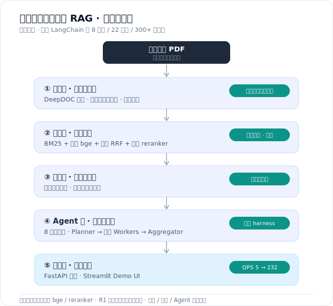

# 金融研报智能问答 · RAG 系统

> 自建券商研报（**8 行业 / 22 标的 / 300+ 篇**）的问答与生成分析系统，打通
> **PDF 解析 → 混合检索 → 跨机构防幻觉聚合 → 分析型 Agent → 服务化** 全链路，
> 并对**检索**做了领域微调、对一个核查子任务做了**模型蒸馏**。
> **全栈自研、未套用 LangChain**——每一层可控、可调、可观测。

技术栈：`Python` · `Elasticsearch` · `sentence-transformers(bge)` · `DeepSeek/Qwen` · `PEFT/TRL(QLoRA)` · `FastAPI` · `Docker`

<p align="center"></p>

## 🎬 演示

<p align="center">
  <video src="https://github.com/Biubiubiu-ikun/finance-research-rag/raw/main/docs/demo.mp4" controls muted width="760"></video>
</p>

> 若上方视频未内嵌播放，点此查看 ▶ [docs/demo.mp4](docs/demo.mp4)

---

## 核心亮点

- **数据层**：DeepDOC 布局解析研报 PDF + 财务表格结构化 + **用 LLM 把表格转自然语言摘要使其可语义检索** + 父子分块。
- **检索层（领域微调，有泛化证据）**：ES 混合检索（BM25 + 微调 bge 向量 + 加权 RRF + 微调 reranker + 元数据过滤）。微调使向量 R@5 **+17pt**，且在 13 个**未训练过**的新行业标的上仍**碾压 SOTA 通用 bge-m3(568M)**（24M 微调 > 568M 通用）。完整管道 **doc R@5 86%**。详见 [EVAL.md](EVAL.md)。
- **生成层（双防幻觉）**：① 每个财务数字逐字回原表溯源 + 量纲兜底 + 时间一致性；② 用 LLM **句级 entailment** 把每条结论回原文做蕴含核查（8 标的 0 幻觉）。
- **Agent 层**：分析型 Agent（8 工具 function calling，**"幻觉锁在工具内"**）+ **Planner→并行 Workers→Aggregator 多 Agent 编排**（3.3x 并行加速）+ Reflexion 自检。
- **自研 Agent 运行时（harness）**：`harness.py` 把工具注册/调度循环/重试/上下文/自检/可观测/多 Agent 编排收口成一层——**手搓 agent harness，不依赖框架**。
- **模型蒸馏（算法能力 + 诚实负结果）**：用 DeepSeek-R1 思维链蒸馏 + QLoRA 微调 Qwen2.5-1.5B 做句级核查（base 70.4%→**92%**，逼近老师 95.5%）；并诚实判定该低频任务不值得用小模型替代 API，保留为**可切换引擎**。
- **工程化**：FastAPI 服务化（延迟/token/成本指标）+ docker compose + 压测定位慢点→进程内 memoize→**QPS 5.2→232**；全自动增量入库（水位线去重、断点续跑、新标的零代码上架）。

---

## 架构（数据流）

```
研报 PDF
  │  DeepDOC 解析 + 表格结构化 + 表格→NL摘要 + 章节语义切分 + 父子分块
  ▼
Elasticsearch  ──  BM25  +  微调bge向量(kNN)  ── 加权RRF ── 微调reranker精排 ── 元数据过滤
  │
  ├─ 盈利预测聚合（数字级溯源防幻觉）
  ├─ 多机构观点聚合（句级 entailment 防幻觉，引擎可切 DeepSeek / 本地蒸馏Qwen）
  ▼
分析型 Agent（8 工具）  ──  多 Agent 编排（Planner / 并行 Workers / Aggregator）
  │   ↑ harness.py：工具调度 · 重试 · 上下文 · 自检 · 可观测
  ▼
FastAPI 服务 / Streamlit Demo UI
```

---

## 目录结构（按职责分层）

代码按**运行时职责**组织为分层 Python 包（单向依赖、无循环）：

```text
finrag/                  # 主包
├── ingest/              # 采集与入库：download_data · ingest(总控) · parse_report/robust_parse(DeepDOC+子进程级超时)
│                        #             extract_structure · table_summary(表格→NL) · chunk(父子分块) · index_es
├── retrieval/           # 检索：retrieve_es(BM25+向量+加权RRF+rerank+时间感知过滤) · finance_tokenize
├── analysis/            # 生成/聚合(防幻觉)：aggregate_forecast(数字级溯源) · aggregate_views(句级entailment)
│                        #                    track_revisions · price_analysis
├── agent/               # Agent/运行时：agent(8工具) · orchestrator(多Agent编排) · harness(运行时门面) · local_verifier(本地蒸馏核查)
├── serving/             # 服务/UI：api(FastAPI) · app(Streamlit) · bench(压测)
├── evaluation/          # 评测：eval_*(检索/生成/Agent/编排) · make_finance_eval(留出集) → 结果见 EVAL.md
└── training/            # 训练：finetune_bge · finetune_reranker · mine_hard_negatives · download_*
lora_finetune/           # 蒸馏子模块：造数据 + R1 思维链蒸馏 + QLoRA + 师生评测（自带 README）
data/                    # 小产物：analysis(聚合md) · eval(评测集) · structured / chunks 等
README.md · EVAL.md · requirements.txt · Dockerfile · docker-compose.yml · watchlist.json
```

> **依赖方向**单向：`serving → agent → analysis / retrieval → ingest`；两个枢纽 `analysis.aggregate_forecast` 与 `agent.agent` 各被 7 个模块依赖。

---

## 如何运行

> ⚠️ 完整运行需 Elasticsearch + 微调 bge 模型 + DeepSeek key。**；
> 仓库主要供**浏览代码 + 复现**。模型权重见下方「模型获取」。

```bash
# 1. 依赖
pip install -r requirements.txt

# 2. Elasticsearch（混合检索后端）
docker compose up -d es        # 或自备 ES 8.x，设环境变量 ES_URL

# 3. 模型（见「模型获取」）

# 4. 密钥：项目根建 .env，写 DEEPSEEK_API_KEY=sk-xxx

# 5. 启动 Demo UI（从仓库根运行）
streamlit run finrag/serving/app.py    # → http://localhost:8501
#   或服务化： uvicorn finrag.serving.api:app --reload
```

### Demo 
1. **💬 智能问答**：自由提问 → Agent 多工具调度 → 答案 + **可溯源的工具调度轨迹**（每个数字取自哪个工具/机构一眼可查）。
2. **🧭 多维简报**：复杂任务 → Planner 拆解 → 多 Worker **并行**调研 → 简报，附**并行加速比**。
3. **📊 标的速览**：选标的渲染 盈利预测一致预期 / 观点聚合 / 预测修正 / 股价回测，自带 ✓/◐/✗ 防幻觉标记；**句级核查引擎可切 DeepSeek / 本地蒸馏 Qwen**。
4. **🔬 事实核查**：输入"研报片段 + 结论" → 本地蒸馏 Qwen 判 支持/不支持 + 推理链，可与 DeepSeek 并排对照。
5. **➕ 上传入库**：上传研报 PDF → 一键走完全链路 → 新标的零代码自动上架。

---

## 模型获取（仓库不含权重）

| 模型 | 用途 | 获取 |
|---|---|---|
| `bge-small-zh-finance` / `-hn` | 检索向量（领域微调，本项目产出） | 见 `finetune_bge.py` 重训 |
| `bge-reranker-finance` | 精排（领域微调） | 见 `finetune_reranker.py` 重训 |
| `out/adapter`（LoRA） | 句级核查蒸馏（Qwen2.5-1.5B） | 见 `lora_finetune/` |
| `Qwen2.5-1.5B-Instruct` | 蒸馏 base | HuggingFace 官方 |

---

## 已知局限与取舍

- **评测规模**：生成/Agent 评测 20/45 题（含 17 越界拒答）；LLM-judge 有自身偏差，最严谨应扩**人工标注黄金集**。
- **蒸馏小模型**：偏保守、本地延迟高于 API，**故不作默认核查引擎**。
- **图表理解**：研报图表未做 VLM 解析（性价比考量，已跳过）。
- **定位**：`harness.py` 是**领域专用 Agent 运行时**，非 LangChain/Claude-Code 那种带沙箱/上下文压缩的通用框架。

---

*仅供技术演示，非投资建议。数据来自公开券商研报。*
